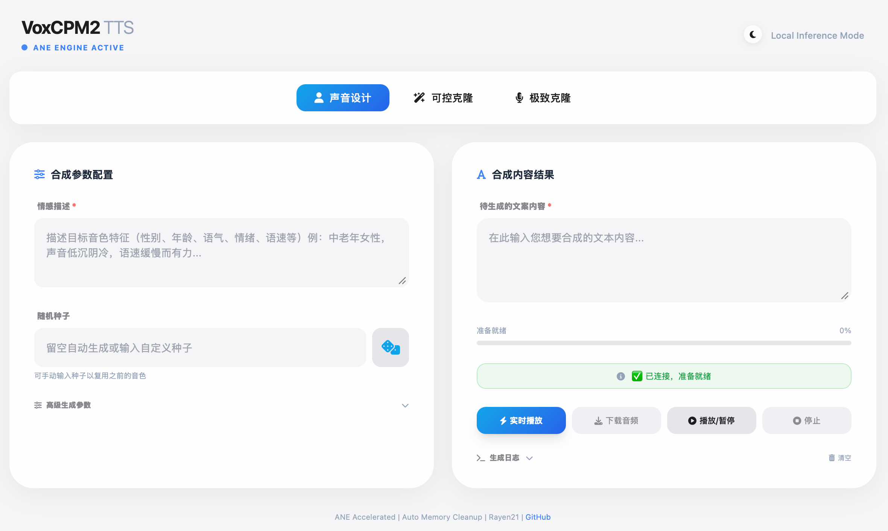
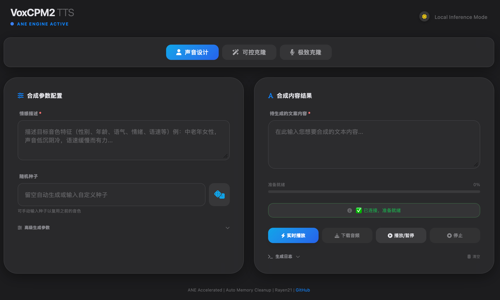

# VoxCPM2 本地部署说明


**Light Mode**



**Dark Mode**

---

## 项目特点

### 1. Apple Neural Engine (ANE) 原生加速
- 基于 CoreML 构建，充分利用 M1/M2/M3 Mac 的神经网络引擎硬件加速
- 使用 `--split-base-lm` 模式解决 M1 设备 CoreML 兼容性问题
- ctranslate2 + Metal → ANE 后端实现 ASR 转录加速

### 2. OpenAI 兼容 API
- `/v1/audio/speech` — 标准语音合成端点（非流式）
- `/v1/audio/speech/stream` — 流式传输 PCM16 音频，支持实时播放
- `/v1/voices` — 自定义声音管理（创建、删除、列表）

### 3. ASR 自动转录
- 集成 faster-whisper (ctranslate2)，支持 tiny/base/small/large-v3 模型
- 默认使用 small 模型，中文识别准确率最佳
- 当 `prompt_text` 为空时自动转录参考音频作为提示文本
- 模型加载后全局缓存 5 分钟，避免重复初始化开销

### 4. LM 推理模式灵活切换
| 模式 | 说明 | 适用场景 |
|------|------|----------|
| single-length (默认) | 使用相同长度预填充和解码 | 通用推荐 |
| preload | 预加载长度 1 和预填充大小 | 追求最佳 RTF |
| always-loaded | 始终保留长度 1 和预填充大小 | 最快响应 |
| hot-swap | 空闲时预加载，解码时切换 | 内存受限时 |

### 5. 自定义声音管理
- **reference** — 仅参考音频，延迟最低
- **reference_plus_prompt** — 参考 + 提示音频，质量更好
- **high_similarity** — 高相似度（使用 ASR 转录），效果最佳

### 6. 实时流式播放
- `streamAndPlay()` 增量解码：每收到一个 chunk 就构建 WAV blob、解码成 AudioBuffer
- 按时间顺序排队到 AudioContext，不再等全部数据收完才一次性播放
- 支持进度条实时更新（字节数 → 百分比）

### 7. Editable Install 开发模式
- `pip install -e .` 让仓库代码直接映射到 conda 环境
- Python 后端修改即时生效，无需重新安装
- 前端文件需手动同步到 site-packages

---

## 从零安装步骤

### Step 1: 准备 Conda 环境

```bash
# 如果没有 Miniforge，先安装：
brew install miniforge

# 创建 Python 3.11 环境（voxcpm2 要求 >=3.10, <3.13）
conda create -n voxcpm2 python=3.11 -y
conda activate voxcpm2
```

### Step 2: 克隆项目源码

```bash
cd ~/Documents  # 或任意你喜欢的目录
git clone https://github.com/Rayen21/Voxcpmane2-ASR.git voxcpm
cd voxcpm
```

> **注意**：仓库目录仅用于开发，不直接运行。

### Step 3: 安装项目（Editable Install）

```bash
pip install -e .
```

这一步会：
1. 把 `src/voxcpmane` 加入 Python import 路径
2. 注册 `voxcpmane2-server` 命令行工具到 conda 环境
3. 安装所有依赖包（numpy, fastapi, uvicorn, tokenizers 等）

验证：
```bash
python -c "import voxcpmane; print(voxcpmane.__file__)"
# 应输出 /Users/hanqingren/voxcpm/src/voxcpmane/__init__.py
```

### Step 4: 下载模型（首次运行自动下载）

```bash
cd ~/Documents/voxcpm
eval "$(conda shell.bash hook)" && conda activate voxcpm2

# 首次启动会自动从 HuggingFace 下载模型到 ~/.cache/huggingface/hub/
voxcpmane2-server --split-base-lm --port 8000
```

> **M1 设备必须加 `--split-base-lm`**，否则 CoreML 会报错。

### Step 5: 验证服务

浏览器打开 http://127.0.0.1:8000，或：
```bash
curl -s http://127.0.0.1:8000/health
# 应返回 {"status": "ok"}
```

### Step 6: 前端文件同步（开发时）

每次修改 `src/voxcpmane/frontend/index.html` 后：
```bash
cp src/voxcpmane/frontend/index.html    $(python -c "import voxcpmane; import os; print(os.path.dirname(voxcpmane.__file__))")/frontend/index.html
```

### Step 7: 停止服务

```bash
# 找到服务器进程
lsof -i :8000 | grep LISTEN

# 杀死进程（替换 PID）
kill <PID>
```

---

## API 端点一览

| 方法 | 路径 | 说明 |
|------|------|------|
| GET | / | Web 前端页面 |
| GET | /health | 服务器健康检查 |
| GET | /voices | 获取可用声音列表 |
| POST | /v1/audio/speech | 生成完整音频（非流式） |
| POST | /v1/audio/speech/stream | 流式传输 PCM16 音频 |
| POST | /v1/audio/speech/playback | 播放生成的音频 |
| POST | /v1/audio/speech/cancel | 取消当前生成 |
| POST | /v1/voices | 创建自定义声音 |
| DELETE | /v1/voices/{name} | 删除自定义声音 |

---

## 目录结构

```
/Users/hanqingren/voxcpm/src/voxcpmane/
├── server.py          # FastAPI HTTP 服务 + OpenAI API
├── generator.py       # VoxCPM2Generator 推理引擎
├── lm.py              # LM 加载与 split-base-lm 支持
├── asr.py             # faster-whisper ASR 转录模块
├── feat_encoder.py    # 特征编码器
├── metrics.py         # RTF 指标统计
└── frontend/
    └── index.html     # Web UI（需手动同步到 site-packages）
```

---

## 常见问题

**Q: 修改代码后没生效？**
A: Python 后端通过 editable install 自动同步，无需操作。前端文件需手动复制（见 Step 6）。

**Q: M1 启动报错 `MLModelConfiguration`？**
A: 必须使用 `--split-base-lm` 参数。

**Q: 模型下载很慢？**
A: 设置代理或使用国内镜像：
```bash
export HF_ENDPOINT=https://hf-mirror.com
voxcpmane2-server --split-base-lm --port 8000
```

---

## 致谢与声明

本项目基于 [0seba/VoxCPMANE](https://github.com/0seba/VoxCPMANE) 修改而来，在此感谢原作者的开源贡献。

本仓库（[Rayen21/Voxcpmane2-ASR](https://github.com/Rayen21/Voxcpmane2-ASR)）为 VoxCPMANE 的社区维护分支，主要更新包括：

- ASR 自动转录模块集成（faster-whisper + ctranslate2）
- split-base-lm 模式支持 M1/M2/M3 Mac 设备
- 自定义声音管理增强与流式播放优化
- 版本升级至 0.1.3b1
